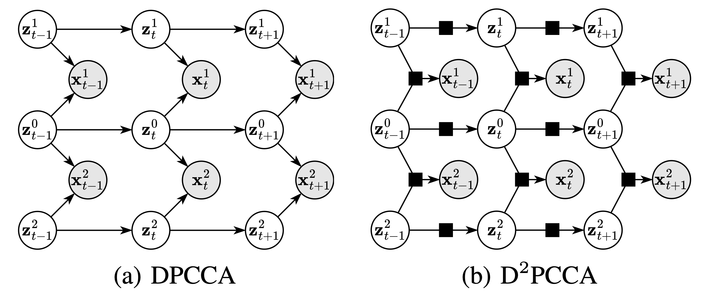

# Deep Dynamic Probabilistic Canonical Correlation Analysis (D2PCCA)

This repository contains the implementation of **"Deep Dynamic Probabilistic Canonical Correlation Analysis"** by Shiqin Tang, Shujian Yu, Yining Dong, and S. Joe Qin. The paper introduces a model that integrates deep learning with probabilistic modeling to analyze nonlinear dynamical systems.



## Abstract
This paper presents Deep Dynamic Probabilistic Canonical Correlation Analysis (D$^2$PCCA), a model that integrates deep learning with probabilistic modeling to analyze nonlinear dynamical systems. Building on the probabilistic extensions of Canonical Correlation Analysis (CCA), D$^2$PCCA captures nonlinear latent dynamics and supports enhancements such as KL annealing for improved convergence and normalizing flows for a more flexible posterior approximation. D$^2$PCCA naturally extends to multiple observed variables, making it a versatile tool for encoding prior knowledge about sequential datasets and providing a probabilistic understanding of the system’s dynamics. Experimental validation on real financial datasets demonstrates the effectiveness of D$^2$PCCA and its extensions in capturing latent dynamics.

## Key Features

- **Nonlinear Latent Dynamics Modeling**: Captures complex temporal dependencies among multiple observed variables.
- **Flexible Posterior Approximation**: Employs normalizing flows to handle multimodal posterior distributions.
- **Versatile Application**: Suitable for various sequential datasets, including financial data, speech signals, and other multivariate time-series data.

## Getting Started

### Prerequisites

To run the code, you need the following dependencies:

- Python 3.x
- [PyTorch](https://pytorch.org/)
- [Pyro](https://pyro.ai/)

You can install the required dependencies using:
```bash
pip install torch pyro-ppl
